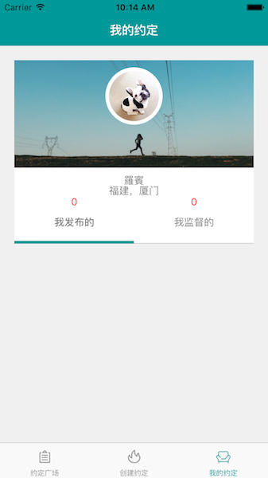

### 关于

模仿别墨迹微信端用 React Native 做的 IOS App

### 如何运行

https://facebook.github.io/react-native/docs/getting-started.html#content

### Bug

[react-native-scrollable-tab-view](https://github.com/brentvatne/react-native-scrollable-tab-view) 下包含 ListView 的时候会有一个警告：'Warnings: ScrollView doesn't take rejection well - scrolls anyway'，详见 https://github.com/brentvatne/react-native-scrollable-tab-view/issues/122

### 感谢

参考了https://github.com/qddegtya/A-ReactNative-TesterHome的代码，借用了icon图片:flushed:

### Demo

由于虚拟机里截 gif 会闪屏，所以就用图片了

